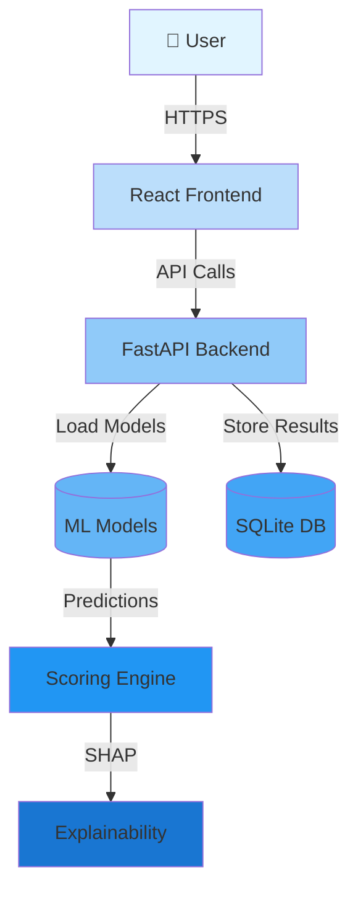
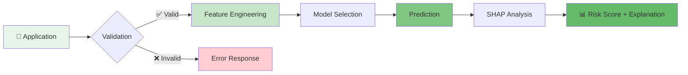

<div align="center">

# 🎯 RiskLens

### AI-Powered Credit Risk Assessment Platform

*Real-time scoring • Batch processing • SHAP explainability*


</div>

---

## 📋 Overview

RiskLens is an enterprise-grade credit risk assessment platform that leverages machine learning to provide accurate, explainable credit scoring. Built with modern web technologies and production-ready ML models, it offers both real-time predictions and batch processing capabilities.

## ✨ Key Features

- **🎯 Real-time Scoring** - Instant credit risk assessment with multiple ML models
- **📊 Batch Processing** - Process thousands of applications efficiently
- **🔍 Model Explainability** - SHAP values for transparent decision-making
- **📈 Portfolio Analytics** - Comprehensive risk distribution insights
- **🔐 Secure Authentication** - JWT-based user management
- **📱 Responsive Design** - Modern UI built with React & Tailwind CSS

## 🏗️ Architecture



## 🔄 Scoring Workflow



## 🚀 Quick Start

### Prerequisites
- Node.js 18+ & npm
- Python 3.9+
- Git

### Frontend Setup

```bash
# Clone repository
git clone <YOUR_GIT_URL>
cd risk-lens

# Install dependencies
npm install

# Start development server
npm run dev
```

### Backend Setup

```bash
cd risklens-backend

# Create virtual environment
python -m venv venv
source venv/bin/activate  # On Windows: venv\Scripts\activate

# Install dependencies
pip install -r requirements.txt

# Run server
python app/main.py
```

## 🛠️ Tech Stack

**Frontend**
- ⚛️ React 18 + TypeScript
- 🎨 Tailwind CSS + shadcn/ui
- ⚡ Vite
- 🔄 React Query
- 📊 Recharts

**Backend**
- 🐍 Python + FastAPI
- 🤖 LightGBM + Scikit-learn
- 📈 SHAP for explainability
- 🔐 JWT authentication
- 💾 SQLite database

## 📁 Project Structure

```
risk-lens/
├── src/              # React frontend
│   ├── components/   # UI components
│   ├── pages/        # Application pages
│   └── lib/          # Utilities & API client
├── risklens-backend/ # FastAPI backend
│   ├── app/          # Application code
│   ├── models/       # Trained ML models
│   └── routes/       # API endpoints
├── notebook/         # Jupyter notebooks
└── data/             # Training datasets
```

## 🎯 API Endpoints

| Method | Endpoint | Description |
|--------|----------|-------------|
| `POST` | `/auth/signup` | User registration |
| `POST` | `/auth/login` | User authentication |
| `POST` | `/api/predict` | Single prediction |
| `POST` | `/api/batch/score` | Batch scoring |
| `GET` | `/api/batch/status/{id}` | Batch job status |

## 📊 Models

- **Logistic Regression** - Baseline interpretable model
- **LightGBM** - High-performance gradient boosting

Both models are trained on historical credit data with extensive feature engineering.

## 📄 License

MIT License - feel free to use this project for your own purposes.

---

<div align="center">

**Built with ❤️ for better credit risk assessment**
